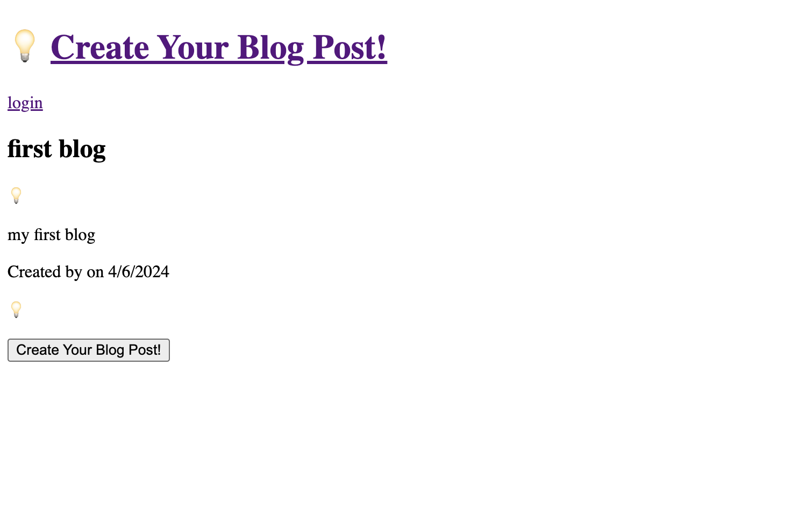

# Challenge 14 MVC-techblog

## Description:
This blog site allows users to log in with their email and password to create, save, delete, and update blog posts. 

## Table of Contents:
- [Usage](#Usage)
- [Install](#Install)
- [What I Learned](#What-I-Learned)
- [Screenshot](#Screeshot)
- [Heroku](#Heroku)
- [Author](#Author)
- [Acknowledgments](#Acknowledgments)

## Usage
```md
AS a blogger
I WANT to be able to view and manage my blog posts and see other blogger's posts.
SO THAT I can communicate with others and gather ideas.
```

## Install
1. Node.js https://nodejs.org/en/
2. Sequelize https://www.npmjs.com/package/sequelize
3. MySQL2 [Version 3.9.1] https://www.npmjs.com/package/mysql2
4. Dotenv https://www.npmjs.com/package/dotenv
5. Bcrypt https://www.npmjs.com/package/bcrypt
6. Express https://www.npmjs.com/package/express-session
7. Handlebars https://www.npmjs.com/package/express-handlebars

## What I Learned
- To build a Node.js application that takes in user input to create a blog with titles and descriptions.

## Screenshot
The following picture shows application:


## Author
Here is my <a href="https://github.com/arielRvaldez/MVC-techblog.git" target="_blank">Github Repo Link</a>.

## Acknowledgements
- Calendy Tutor